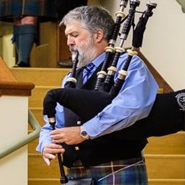

---
output:
  xaringan::moon_reader:
    css: "my-theme.css"
    lib_dir: libs
    nature:
      highlightStyle: github
      highlightLines: true
---

```{r setup, include=FALSE, message=FALSE}
options(htmltools.dir.version = FALSE, servr.daemon = TRUE)
library(huxtable)
```


class: center, middle

# Effects of prior information on Bayesian estimates of species interactions from time series data

## Mark Scheuerell

_USGS WA Cooperative Fish and Wildlife Research Unit<br>School of Aquatic and Fishery Sciences<br>University of Washington<br>_

.purple-text.futnote[`r icon::fa("envelope")` scheuerl@uw.edu]

.blue-text.citation[`r icon::fa("twitter")` @mark_scheuerell]


---

class: frimg

# Coauthors

.pull-left[]

.pull-right[]

.pull-left.center[Eric Ward (NOAA)]

.pull-right.center[Steve Katz (Wash St Univ)]


---

class: center, middle, inverse

# Estimating species interactions is a long standing goal in ecology


---

class: frimg, inverse

background-image: url(figs/bob_paine.jpg)
background-size: 60%

.gray-text.futnote[Photo: Anne Paine]


---

class: frimg, inverse

background-image: url(figs/steve_carpenter.jpg)
background-size: 70%

.gray-text.futnote[Photo: Adam Hinterthuer]


---

# Estimating interactions from time series

```{r plot_many_ts, echo=FALSE, dpi=300, fig.height=4, fig.width=7, fig.align='center'}
NN <- 3
TT <- 30
MM <- 3
 
set.seed(123)
## MM x TT matrix of innovations
ww <- matrix(rnorm(MM*TT, 0, 1), MM, TT)
ww[,1] <- rnorm(MM, 0, sqrt(5))
## MM x TT matrix of scaled latent trends
xx <- t(scale(apply(ww,1,cumsum)))

## loadings matrix
ZZ <- matrix(runif(NN*MM, -1, 1), NN, MM)
diag(ZZ) <- rev(sort(abs(diag(ZZ))))
ZZ[upper.tri(ZZ)] <- 0
ZZ <- round(ZZ, 2)

## obs var
obs_var <- 0.2^2
## obs errors
ee <- t(MASS::mvrnorm(TT, matrix(0,NN,1), diag(obs_var,NN,NN)))
## NN x TT matrix of observed data
yy <- ZZ %*% xx + ee

clr <- viridis::plasma(NN, alpha=0.7, end=0.8)

vv <- sample(seq(NN), NN)

labs <- c("Producer", "Herbivore", "Predator")

par(mfrow=c(1,3), mai=c(0.5,0.5,0.5,0), omi=c(0,0,0,0)) 

for(i in 1:NN) {
	plot.ts(yy[vv[i],], lwd=2,
	        xlab="", xaxt="n", ylab="", yaxt="n", main = labs[i],
	        col=clr[i], bty="n", cex.main = 2)
}
```


---

# Multivariate autoregressive models

## Describe .blue-text[community dynamics] over time

```{r state_diag, dpi=300, fig.height=4, fig.width=8, out.height="100%", out.width="100%", fig.align='center', echo=FALSE, warning=FALSE}
par(mai=c(0.8,0.8,0,0), omi=rep(0,4))
## boundaries
ss <- 5
nn <- 7
rr <- ss*3
cc <- ss*nn
## mid-points
xm <- ss/2 + seq(0,cc-ss,ss)
ymt <- rr - ss/2
ymb <- ss/2
## arrow locs
x0t <- seq(ss, by=2*ss, len=3)
x1t <- x0t + ss
## empty plot space
plot(c(0,cc), c(0,rr), type="n", xlab="", ylab="",
     xaxt="n", yaxt="n", bty="n")
## top row: state
symbols(x=xm[c(1,3,5,7)], y=rep(ymt,4), circles=rep(ss/2,4),
        lty="solid",  fg=NA, bg="#488fdf",
        inches=FALSE, add=TRUE, lwd=3)
# text("Truth", x=-ss, y=ymt, adj=c(0,0.5), xpd=NA,
#      cex=2, col="#488fdf")
arrows(x0=x0t,x1=x1t,y0=ymt, col="#488fdf", lwd=3, length=0.12)
## Time or space
arrows(x0=ss/2, x1=cc-ss/2, y0=-ss/3+ss*2,
       length=0.12, lwd=3, xpd=NA)
text("Time", x=cc/2, y=-ss/2+ss*2, xpd=NA, pos=1, cex=2)
```

.gray-text.citation[Ives et al (2003) *Ecology*]


---

class: center, middle, inverse

# Observing nature can be easy

---

class: frimg, bottom, right
background-image: url(figs/sockeye.jpg)
background-size: cover

# .white-text[How many sockeye are there?]

---

class: center, middle, inverse

# Observing nature can also be hard

---

class: frimg, bottom, right
background-image: url(figs/sockeye.jpg)
background-size: cover

# .white-text[How many mayflies are there?]

---

# Multivariate autoregressive models

## .purple-text[Data] = .blue-text[Truth] &#177; .red-text[Errors]

```{r obs_diag, dpi=300, fig.height=4, fig.width=8, out.height="100%", out.width="100%", fig.align='center', echo=FALSE, warning=FALSE}
par(mai=c(0.8,0.8,0,0), omi=rep(0,4))
## arrow locs
x0t <- seq(ss, by=2*ss, len=3)
x1t <- x0t + ss
y0b <- rr - ss
y1b <- ss
## empty plot space
plot(c(0,cc), c(0,rr), type="n", xlab="", ylab="",
     xaxt="n", yaxt="n", bty="n")
## top row: state
symbols(x=xm[c(1,3,5,7)], y=rep(ymt,4), circles=rep(ss/2,4),
        lty="solid",  fg=NA, bg="#488fdf",
        inches=FALSE, add=TRUE, lwd=3)
text("Truth", x=-ss, y=ymt, adj=c(0,0.5), xpd=NA,
     cex=2, col="#488fdf")
## arrows
arrows(x0=x0t,x1=x1t,y0=ymt, col="#488fdf", lwd=3, length=0.12)
## bottom row: obs
symbols(x=xm[c(1,3,5,7)], y=rep(ss/2,4), circles=rep(ss/2,4),
        lty="solid",  fg=NA, bg="#844870",
        inches=FALSE, add=TRUE, lwd=3)
text("Data", x=-ss, y=ss/2, adj=c(0,0.5), xpd=NA,
     cex=2, col="#844870")
## arrows
arrows(x0=xm[c(1,3,5,7)], y0=y0b, y1=y1b,
       col="#c10101", lwd=3, length=0.12)
## Time or space
arrows(x0=ss/2, x1=cc-ss/2, y0=-ss/3,
       length=0.12, lwd=3, xpd=NA)
text("Time", x=cc/2, y=-ss/2, xpd=NA, pos=1, cex=2)
```

---

# Multivariate autoregressive models

## .blue-text.under[State model]

## .blue-text[Density]<sub><i>t</i></sub> = .blue-text[Density]<sub><i>t</i>-1</sub> + .orange-text[Environment]<sub><i>t</i></sub> + .gray-text[error]<sub><i>t</i></sub>

## .purple-text.under[Observation model]

## .purple-text[Data]<sub><i>t</i></sub> = .blue-text[Density]<sub><i>t</i></sub> + .red-text[error]<sub><i>t</i></sub>

.gray-text.citation[Ives et al (2003) *Ecology*]


---

# How does one actually do this?

## .green-text[Canned **R** packages] (`dlm`, `vars`, `MARSS`<sup>*</sup>)

## .blue-text[Code-your-own] (`JAGS`, `Stan`, `greta`)

.footnoteSm.gray-text[
<sup>\*</sup>Holmes, Ward, Scheuerell (2020) _Analysis of multivariate time-series using the MARSS package_
]


---

class: center, middle, inverse

# How accurate and precise are these models?


---

class: frimg
background-image: url(figs/linear_food_chain.png)
background-position: 90% 50%
background-size: 14%

# Simulation of species interactions

## 4-member food chain


